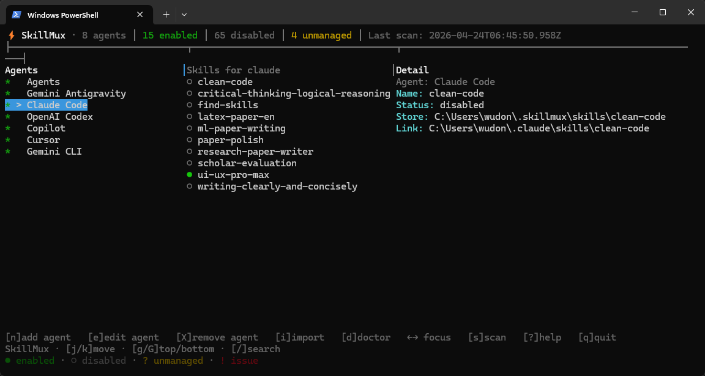

<p align="center">
  
</p>

<p align="center">
  <strong>跨 AI Coding Agent 统一管理本地 skills 的命令行工具。</strong>
</p>

<p align="center">
  
  
</p>

<!-- README-I18N:START -->

**中文** | [English](./README.en.md)

<!-- README-I18N:END -->

---

## SkillMux 是什么

AI coding agent（Codex、Claude、Gemini 等）各自有自己的 `skills/` 目录，里面是指向共享 skill 文件的 symlink 或 junction。手动管理这些链接——决定哪个 agent 能看到哪个 skill——很快就会变得一团糟。

SkillMux 把你的 skills 集中到 `~/.skillmux/`，然后按 agent 统一管理 symlink 的暴露。一次安装，任意启用或停用，不需要重新下载，不需要在隐藏目录里翻找。

你可以自己在终端里用，也可以交给 AI agent —— SkillMux 两者都支持。

## 预览

<p align="center">
  
</p>

## 功能特性

- **统一 skill 仓库** —— 每个 skill 只存一份实体，通过 symlink 暴露到各 agent 目录
- **按 agent 控制可见性** —— 对任意 agent 独立启用或停用任意 skill
- **自动发现** —— 自动检测 `.codex/skills`、`.claude/skills`、`.gemini/skills`，以及任何 `./xxx/skills` 目录
- **TUI 仪表板** —— 交互式终端界面，浏览、搜索、启用、停用、接管、删除 skills
- **批量操作** —— 一条命令操作多个 skills 或 agents
- **AI 友好** —— JSON 输出和确定性行为，适合让 AI agent 代管
- **默认安全** —— 从不删除原始文件；`disable` 仅移除受管链接；`remove` 在 skill 仍被使用时拒绝执行

## 安装

```
npm install -g skillmux
```

> [!NOTE]
> 需要 **Node.js >= 20**。卸载 CLI 不会删除 `~/.skillmux/` 中的数据。

## 快速开始

运行 TUI 仪表板，跟随直觉操作：

```bash
skillmux tui
```

按 `?` 查看键盘快捷键，底部会标注所有图标含义。

如果你更喜欢命令行：

```bash
skillmux agents                  # 查看识别到哪些 agent
skillmux scan                    # 扫描本地 skill 目录
skillmux adopt --agent codex --skill find-skills   # 将 skill 纳入管理
skillmux enable --skill find-skills --agent claude # 共享给另一个 agent
skillmux list --view skills      # 查看当前状态
```

从某个 agent 移除一个 skill：

```bash
skillmux disable --skill find-skills --agent claude
```

在所有 agent 都停用后，彻底删除：

```bash
skillmux remove --skill find-skills
```

## 工作原理

```
~/.skillmux/
  config.json          # agent 目录规则（内置、自动发现、自定义）
  manifest.json        # 托管 skill 注册表
  skills/
    find-skills/       # <-- 实体副本（真实文件在这里）
    clean-code/
    ...

~/.codex/skills/
  find-skills/   --> ~/.skillmux/skills/find-skills/   (symlink/junction)

~/.claude/skills/
  find-skills/   --> ~/.skillmux/skills/find-skills/   (symlink/junction)
```

SkillMux 把每个 skill 的真实内容复制一份到托管仓库，然后在各 agent 的 `skills/` 目录下创建链接。`enable` 创建链接，`disable` 移除链接但保留内容。`import` 和 `adopt` 将外部 skill 纳入管理，`remove` 在不再需要时清理仓库。

**内置支持的 agent：** `.codex`、`.claude`、`.gemini`、`.agents`、`.openclaw`。  
**自动发现：** home 目录下任何 `./xxx/skills` 目录都会被自动识别。

## CLI 命令

### 设置

| 命令 | 说明 |
|---|---|
| `skillmux agents [--json]` | 列出识别到的 agent 目录（`builtin` / `auto` / `custom`） |
| `skillmux config` | 显示当前解析的配置 |
| `skillmux config add-agent --id ... --root ...` | 注册自定义 agent 目录 |
| `skillmux config update-agent --id ...` | 更新自定义 agent 规则 |
| `skillmux config remove-agent --id ...` | 删除自定义 agent 规则 |
| `skillmux scan [--json]` | 扫描 agent skill 目录并刷新状态 |

### 管理

| 命令 | 说明 |
|---|---|
| `skillmux adopt --agent <id> [--skill <name>]` | 将 agent 侧的 skill 纳入 SkillMux 管理 |
| `skillmux import --source <path> --name <id>` | 导入本地 skill 目录 |
| `skillmux enable --skill <name> --agent <id>` | 将托管 skill 暴露给某个 agent |
| `skillmux disable --skill <name> --agent <id>` | 从某个 agent 隐藏托管 skill |
| `skillmux remove --skill <name>` | 从托管仓库删除 skill（必须已全部停用） |

### 检查

| 命令 | 说明 |
|---|---|
| `skillmux list [--view agents\|skills\|records]` | 查看托管状态 |
| `skillmux doctor [--json]` | 检查坏链、孤立项和异常状态 |

对任意命令使用 `--help` 查看所有可用参数。

## TUI 键盘快捷键

| 按键 | 功能 |
|---|---|
| `←` `→` | 在 Agents 和 Skills 面板间切换焦点 |
| `Space` | 启用 / 停用当前选中的托管 skill |
| `a` | 接管一个未托管 skill（需确认） |
| `r` | 移除一个已全部停用的 skill（需确认） |
| `s` | 扫描 agent 目录并刷新 |
| `/` | 在当前聚焦列表内搜索 |
| `?` | 打开帮助 |
| `q` | 退出 |

非交互式终端或脚本场景，请改用 `skillmux list`、`skillmux scan` 或 `skillmux doctor`。

## 批量操作

重复 flag 可在一条命令中操作多个目标：

```bash
skillmux enable --skill find-skills --agent codex --agent claude
skillmux disable --skill find-skills --agent codex --agent claude
skillmux adopt --agent codex --skill find-skills --skill clean-code
skillmux remove --skill old-skill --skill unused-skill
```

如果批量操作中途失败，SkillMux 会报告已完成的项目，方便你继续处理。

## 与 `npx skills` / `skills.sh` 的关系

`npx skills` 负责从远端仓库下载 skills。SkillMux 不替代它——SkillMux 管理的是已经存在于本地的 skills。

推荐流程：

```
npx skills add https://github.com/vercel-labs/skills --skill find-skills
skillmux scan
skillmux adopt --agent codex --skill find-skills
skillmux enable --skill find-skills --agent claude
```

## 给 AI 使用

如果你把这个 README 交给 AI，以下是它需要知道的关键信息：

- 安装：`npm install -g skillmux`
- 远端安装：继续使用 `npx skills` / `skills.sh`
- 查看环境：`skillmux agents`、`skillmux scan`
- 纳入管理：`skillmux adopt`、`skillmux import`
- 控制可见性：`skillmux enable`、`skillmux disable`
- 清理：`skillmux remove`
- 检查健康：`skillmux doctor`
- JSON 输出：在任意命令后加 `--json` 获取结构化数据

> [!IMPORTANT]
> `scan`、`import`、`enable`、`disable`、`adopt`、`remove` 以及 config 写入类子命令都会直接修改本地状态。
> `disable` 仅移除受管链接——不会触碰普通目录。
> `remove` 在 skill 仍对任何 agent 启用时会拒绝执行。
> `import` 复制内容但不会删除原始目录。
> Windows 下目录链接使用 junction 语义。
> 手动修改过 agent 目录后，请重新运行 `skillmux scan`。
